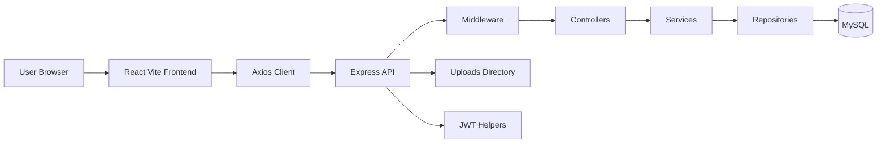
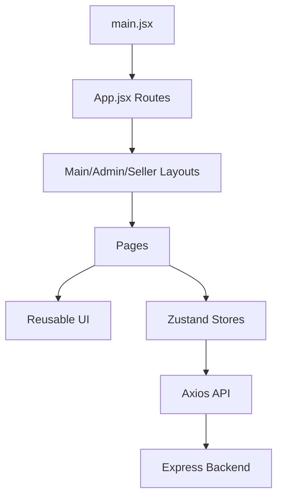
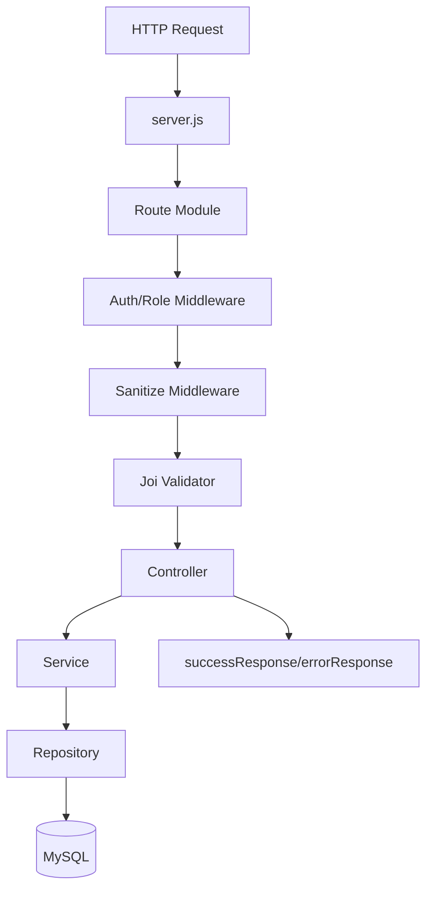
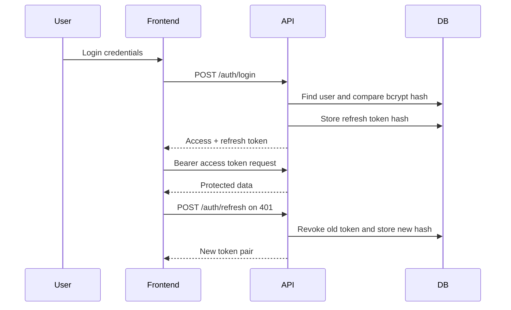
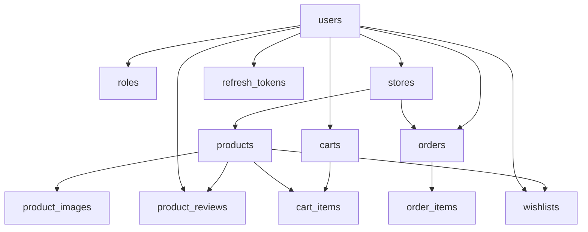
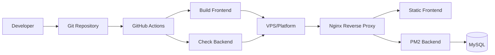
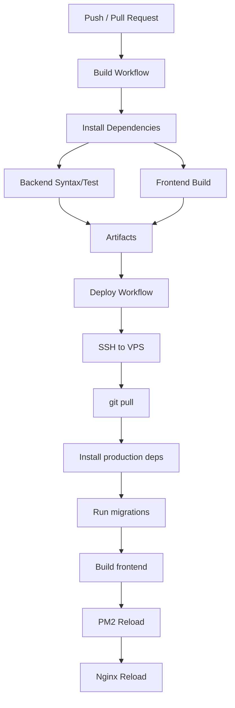

# ARCHITECTURE_DIAGRAMS.md

# Architecture Diagrams / Diagram Arsitektur

## 1. System Architecture

## 2. Frontend Flow

## 3. Backend Flow

## 4. Authentication Flow

## 5. Database Flow

## 6. Deployment Flow

## 7. CI/CD Flow

