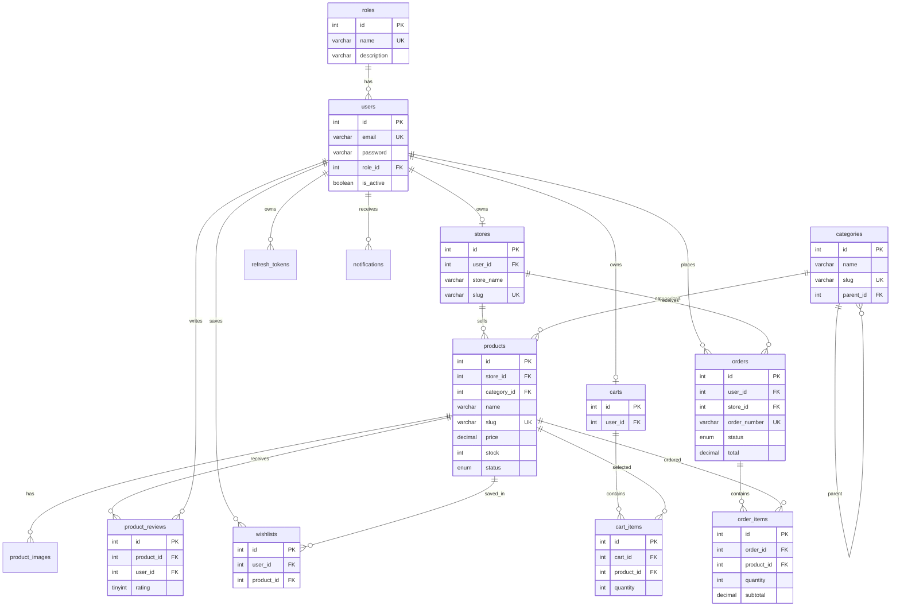

# DATABASE_GUIDE.md

# Database Guide / Panduan Database

Database engine: MySQL 8.0 recommended.  
Engine database yang direkomendasikan: MySQL 8.0.

## 1. Overview / Ringkasan

The schema is defined in `schema.sql`. Initial data is defined in `seed.sql`. The database uses InnoDB, UTF-8 MB4 collation, foreign keys, indexes, unique keys, enum fields, and check constraints.

## 2. Tables / Tabel

### roles
Stores role definitions.

| Column | Purpose |
|---|---|
| id | Primary key |
| name | Unique role name |
| description | Role description |
| created_at, updated_at | Timestamps |

### users
Stores all user accounts.

Key relationships:
- `role_id` references `roles.id`.

Important indexes:
- `email` unique.
- `idx_users_role_id`.
- `idx_users_is_active`.

### stores
Stores seller stores.

Key relationships:
- `user_id` references seller `users.id`.

Important constraints:
- One store per user via unique `user_id`.
- Unique `slug`.

### categories
Stores product categories and parent/child category tree.

Key relationships:
- `parent_id` self-references `categories.id`.

### products
Stores product catalog and inventory.

Important fields:
- `store_id`
- `category_id`
- `price`
- `stock`
- `condition`
- `status`
- `views`

Important indexes:
- store, category, status, price, stock, views, created_at.
- full-text index on name and description.

### product_images
Stores product image paths.

Key relationships:
- `product_id` references `products.id`.

### product_reviews
Stores product reviews.

Rules:
- Rating must be 1-5.
- Unique review per product/user.

### wishlists
Stores customer saved products.

Rules:
- Unique wishlist row per user/product.

### carts
Stores one cart per customer user.

### cart_items
Stores products and quantities in carts.

Rules:
- Unique product per cart.
- Quantity must be positive.

### orders
Stores order header information.

Important fields:
- `user_id`
- `store_id`
- `order_number`
- `status`
- `subtotal`, `shipping_cost`, `total`
- shipping address fields.

### order_items
Stores order line items and historical product name/price snapshots.

### refresh_tokens
Stores hashed refresh tokens for session rotation/revocation.

### site_settings
Stores key-value site settings.

### notifications
Stores user notifications.

## 3. Relationships / Relasi



## 4. Indexes / Indeks

Important indexes are used for:
- Authentication lookup: `users.email`.
- Role filtering: `users.role_id`.
- Product listing: status, category, price, stock, views, created_at.
- Product search: FULLTEXT name/description.
- Order dashboards: `orders.store_id`, `orders.created_at`, `orders.status`.
- Token cleanup: `refresh_tokens.expires_at`, `refresh_tokens.revoked_at`.
- Notifications: user and read status.

## 5. Constraints / Constraint

- Foreign keys enforce ownership and cascading deletes.
- Check constraints prevent negative price, stock, weight, views, totals, and quantities.
- Enum fields constrain status and condition values.
- Unique keys prevent duplicate emails, slugs, cart rows, reviews, and wishlist records.

## 6. Migration Strategy / Strategi Migrasi

Current migration files are raw SQL and run using:
```bash
cd backend
npm run migrate -- ../backend/migrations/<file>.sql
```

Production recommendation:
- Add `schema_migrations` table.
- Track applied migrations.
- Support rollback files.
- Test migrations on staging first.

## 7. Backup Priority / Prioritas Backup

Back up together:
1. MySQL database.
2. Upload directory/object storage.
3. Environment configuration stored securely outside Git.
