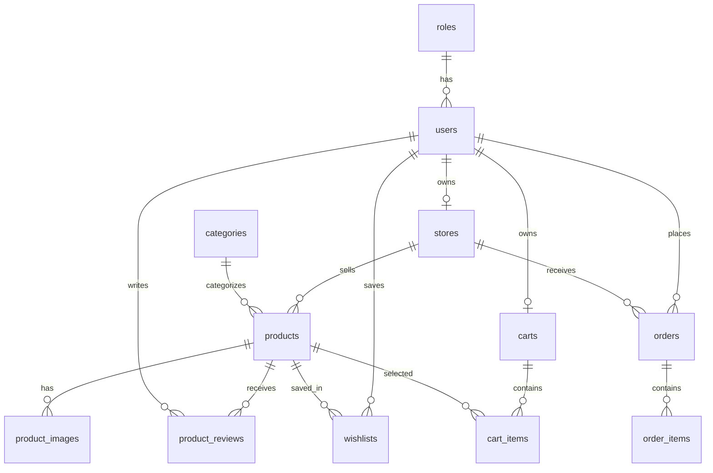

# Database Guide

## Overview
The database is a MySQL schema defined in `schema.sql` with seed data in `seed.sql`. It uses InnoDB, UTF-8 MB4 collation, foreign keys, indexes, unique keys, enum fields, and check constraints.

## Tables
- `roles`: role definitions.
- `users`: all accounts.
- `stores`: seller stores.
- `categories`: product categories.
- `products`: catalog and inventory.
- `product_images`: product image paths.
- `product_reviews`: ratings and comments.
- `wishlists`: customer saved products.
- `carts` and `cart_items`: shopping cart records.
- `orders` and `order_items`: order headers and line items.
- `refresh_tokens`: hashed refresh tokens.
- `site_settings`: key-value settings.
- `notifications`: user notifications.

## ERD

## Indexes and Constraints
Important indexes support user lookup, product listing, order dashboards, token cleanup, and notification filtering. Constraints prevent duplicate reviews, duplicate wishlist records, negative stock, invalid prices, and orphaned relational data.
