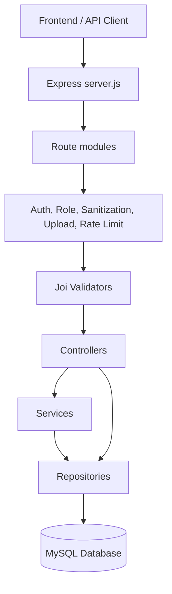
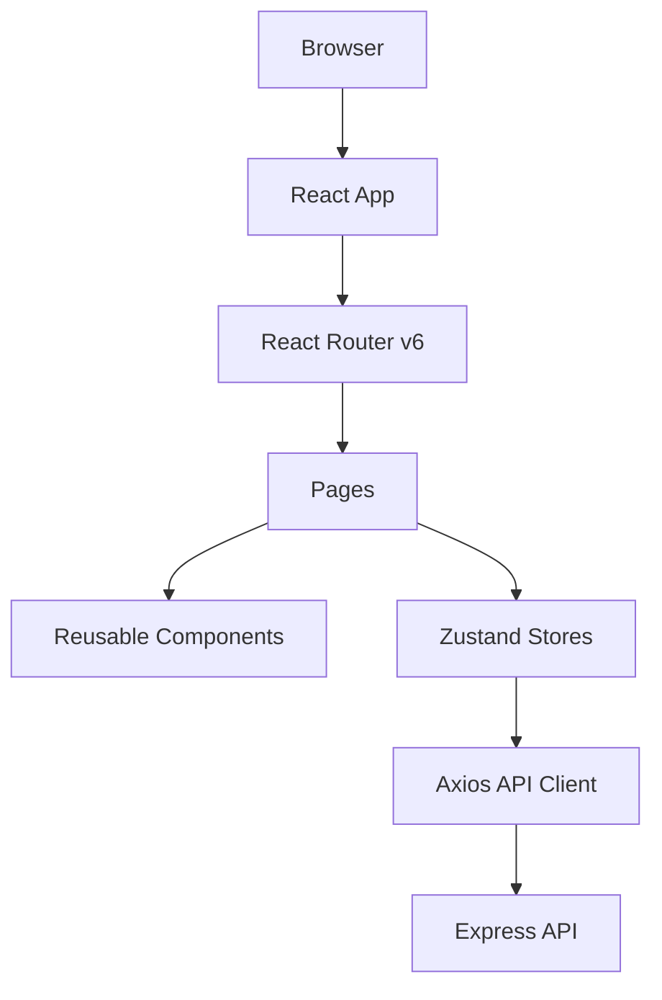

# SYSTEM_ANALYSIS.md

# Multi User Marketplace Website - System Analysis

> English and Indonesian documentation.  
> Dokumentasi Bahasa Inggris dan Bahasa Indonesia.

## 1. Executive Summary / Ringkasan Eksekutif

### English
The Multi User Marketplace Website is a full-stack marketplace application for three main roles: **administrator**, **seller**, and **customer**. The frontend is a React 18 SPA built with Vite, TailwindCSS, Zustand, React Router v6, Axios, and dashboard chart UI built with existing React/Tailwind components. The backend is a Node.js/Express API using JWT access/refresh authentication, bcrypt password hashing, Joi validation, Helmet security headers, CORS controls, Multer uploads, and MySQL persistence.

The repository contains a practical layered backend structure: routes, middleware, validators, controllers, services, repositories, helpers, configuration, and migration scripts. The frontend contains route-based pages, reusable UI/layout components, API services, state stores, and shared utilities.

The system is suitable as a foundation for a production marketplace, but several enterprise-readiness items should be prioritized: complete endpoint coverage for admin/seller product/order operations, stronger input validation for newly added marketplace endpoints, upload malware scanning, centralized logging, automated tests, idempotent migrations, observability, background jobs, and CI/CD secrets hardening.

### Indonesian
Multi User Marketplace Website adalah aplikasi marketplace full-stack untuk tiga peran utama: **administrator**, **seller/penjual**, dan **customer/pelanggan**. Frontend menggunakan React 18 SPA dengan Vite, TailwindCSS, Zustand, React Router v6, Axios, dan stack frontend yang siap untuk chart. Backend menggunakan Node.js/Express dengan autentikasi JWT access/refresh token, hashing password bcrypt, validasi Joi, Helmet, kontrol CORS, upload Multer, dan database MySQL.

Repositori sudah memiliki struktur backend berlapis: routes, middleware, validators, controllers, services, repositories, helpers, konfigurasi, dan script migrasi. Frontend memiliki halaman berbasis routing, komponen UI/layout reusable, service API, state store, dan utility bersama.

Sistem ini layak sebagai fondasi marketplace production, namun beberapa hal enterprise-readiness perlu diprioritaskan: kelengkapan endpoint admin/seller untuk produk/order, validasi input yang lebih kuat untuk endpoint marketplace baru, pemindaian malware pada upload, centralized logging, automated tests, migrasi idempotent, observability, background jobs, dan pengamanan secret CI/CD.

---

## 2. Repository Folder Structure / Struktur Folder Repositori

```text
.
├── backend/                  # Express API application
│   ├── config/               # Environment and database configuration
│   ├── controllers/          # HTTP request handlers
│   ├── helpers/              # Error, JWT, response, string helpers
│   ├── middleware/           # Auth, role, upload, rate limit, sanitize middleware
│   ├── migrations/           # SQL migration files
│   ├── repositories/         # SQL/data access layer
│   ├── routes/               # Express route modules
│   ├── scripts/              # Utility scripts such as migration runner
│   ├── services/             # Business logic services
│   ├── uploads/              # Local upload storage placeholder
│   ├── validators/           # Joi request validation schemas
│   └── server.js             # API bootstrap
├── frontend/                 # React SPA
│   ├── src/api/              # Axios API client
│   ├── src/components/       # Layout and reusable UI components
│   ├── src/config/           # Frontend constants from Vite env vars
│   ├── src/pages/            # Route pages by public/admin/seller/customer area
│   ├── src/stores/           # Zustand stores
│   └── src/utils/            # Browser/session helpers
├── docs/                     # Markdown and HTML documentation website
├── schema.sql                # Full database schema
├── seed.sql                  # Initial roles, users, categories, products, settings
├── Dockerfile.*              # Container build definitions
├── docker-compose.yml        # Local container orchestration
├── nginx.conf                # General Nginx reverse proxy config
├── production.conf           # Domain-oriented Nginx production server config
└── ecosystem.config.js       # PM2 production process definition
```

---

## 3. Source Code Architecture / Arsitektur Source Code

### Backend Architecture


**Observed architecture:**
- Auth endpoints are mature: routes call validators, controllers call `authService`, and service uses repositories.
- Product/category/wishlist/cart/order/seller endpoints currently call repositories or SQL from controllers in several places.
- Repositories centralize some SQL, but the rule in `backend/ARCHITECTURE.md` says SQL should live in repositories; newer controllers should be refactored to comply fully.

**Arsitektur yang ditemukan:**
- Endpoint auth cukup matang: route memakai validator, controller memanggil `authService`, service memakai repository.
- Endpoint product/category/wishlist/cart/order/seller sebagian masih menjalankan SQL langsung dari controller.
- Repository sudah memusatkan sebagian SQL, namun aturan di `backend/ARCHITECTURE.md` menyatakan SQL sebaiknya berada di repository; controller baru perlu direfaktor agar konsisten.

### Frontend Architecture


Frontend uses route pages for public, customer, seller, and admin experiences. Zustand stores manage auth, cart, products, notifications, and toasts. Axios interceptors attach bearer tokens and refresh tokens on `401` responses.

---

## 4. API Architecture / Arsitektur API

### Main API Groups
| Group | Prefix | Purpose |
|---|---|---|
| Health | `/api/health` | Runtime health check |
| Authentication | `/api/auth` | Register, login, refresh, logout, profile, password |
| Products | `/api/products` | Product listing, details, reviews |
| Categories | `/api/categories` | Category listing |
| Wishlist | `/api/wishlist` | Customer wishlist |
| Cart | `/api/cart` | Customer cart |
| Orders | `/api/orders` | Customer orders/checkout |
| Seller | `/api/seller` | Seller dashboard and product data |

### API Response Shape
```json
{
  "success": true,
  "message": "Operation completed.",
  "data": {}
}
```

Error response:
```json
{
  "success": false,
  "message": "Validation failed.",
  "errors": []
}
```

---

## 5. Authentication Flow / Alur Autentikasi

```mermaid
sequenceDiagram
  participant U as User
  participant F as Frontend
  participant A as API
  participant DB as MySQL
  U->>F: Submit login/register
  F->>A: POST /api/auth/login or /register
  A->>DB: Verify user / create user
  A->>DB: Store refresh token hash
  A-->>F: Access token + refresh token + user
  F->>F: Store access token in sessionStorage; refresh token in localStorage
  F->>A: API request with Authorization Bearer token
  A-->>F: Protected resource
  A-->>F: 401 when access token expires
  F->>A: POST /api/auth/refresh
  A->>DB: Rotate refresh token
  A-->>F: New token pair
```

- Access tokens are signed JWTs.
- Refresh tokens are JWTs with `jti`, hashed server-side with SHA-256 before storage.
- Logout revokes refresh tokens.
- Frontend refreshes access token automatically after a `401` when possible.

---

## 6. Authorization Flow / Alur Otorisasi

Roles are represented by numeric `role_id` values:

| Role | ID | Main Access |
|---|---:|---|
| Admin | 1 | Admin dashboard, users, categories, orders, settings |
| Seller | 2 | Seller dashboard, products, orders, store profile |
| Customer | 3 | Cart, orders, profile, wishlist, reviews |

Backend middleware:
- `authMiddleware` verifies access JWT.
- `optionalAuthMiddleware` reads valid tokens on public product detail but does not require login.
- `roleMiddleware` enforces role access.

Frontend route protection:
- `ProtectedRoute` redirects unauthenticated users and denies unauthorized roles.

---

## 7. Database Structure / Struktur Database

Tables discovered in `schema.sql`:
- `roles`
- `users`
- `stores`
- `categories`
- `products`
- `product_images`
- `product_reviews`
- `wishlists`
- `carts`
- `cart_items`
- `orders`
- `order_items`
- `refresh_tokens`
- `site_settings`
- `notifications`

The schema uses foreign keys, indexes, unique constraints, enum status fields, and check constraints. `products.stock` supports inventory management. `product_reviews` supports one review per user/product. `wishlists` supports one wishlist record per user/product.

---

## 8. File Upload System / Sistem Upload File

- Upload middleware uses Multer disk storage.
- Files are stored in `UPLOAD_DIR` or `uploads/` by default.
- Static files are exposed by Express at `/uploads`.
- File size limit defaults to 2 MB via `MAX_FILE_SIZE`.
- Allowed MIME types include JPEG, PNG, WebP, and GIF.

**Security note:** The current implementation checks MIME type only. Production should add extension validation, image re-encoding, antivirus scanning, private object storage, signed URLs, and upload cleanup jobs.

---

## 9. Environment Variables / Variabel Lingkungan

Backend variables are read by `backend/config/app.js` and helpers. Frontend variables are read by Vite through `import.meta.env`. See `ENVIRONMENT_GUIDE.md` for every variable.

Important variables:
- `PORT`
- `DB_HOST`, `DB_PORT`, `DB_USER`, `DB_PASSWORD`, `DB_NAME`
- `JWT_SECRET`, `JWT_ACCESS_EXPIRES_IN`, `JWT_REFRESH_EXPIRES_IN`, `JWT_REFRESH_TTL_DAYS`
- `ALLOWED_ORIGINS`
- `UPLOAD_DIR`, `MAX_FILE_SIZE`
- `VITE_API_URL`, `VITE_SITE_NAME`, `VITE_WHATSAPP_NUMBER`

---

## 10. Security Review / Review Keamanan

### Strengths / Kekuatan
- Passwords hashed with bcrypt.
- JWT access token and refresh token rotation implemented.
- Refresh tokens stored as hashes in database.
- Helmet security headers enabled.
- CORS allowlist supported.
- Auth rate limiting exists for sensitive auth endpoints.
- Request sanitization attempts to reduce XSS payloads in input.
- Joi validators exist for auth, product, category, and order payloads.
- SQL uses parameterized queries in reviewed code paths.

### Risks / Risiko
| Risk | Impact | Recommendation |
|---|---|---|
| Some newer controllers contain SQL directly | Harder to audit and test | Move SQL to repositories/services |
| Limited validation on some new endpoints | Bad input may reach SQL/business logic | Add Joi schemas for all route bodies, query params, and params |
| Refresh token also returned to client JS | XSS impact can include token theft | Prefer HTTP-only refresh cookie only in production |
| Upload validation is MIME-based | Spoofed files may pass | Verify extensions, magic bytes, re-encode images, scan malware |
| No CSRF middleware for cookie refresh endpoint | Cookie-based refresh may be abused if CORS misconfigured | Add CSRF token or SameSite strict strategy |
| No centralized audit logs | Incident response harder | Add structured request/auth/admin audit logs |
| No automated tests | Regression risk | Add unit, integration, API, and E2E tests |
| No security dependency audit workflow | Vulnerabilities may go unnoticed | Add `npm audit`/Dependabot/Snyk/GitHub Advanced Security |

---

## 11. Scalability Review / Review Skalabilitas

### Current Readiness
- Stateless access-token API can run multiple backend instances.
- MySQL connection pool is configured.
- PM2 ecosystem file exists for backend process management.
- Static frontend can be served through CDN/Nginx.

### Scalability Gaps
- Local disk uploads do not scale across multiple app servers.
- No Redis/session/cache layer.
- No queue for emails, notifications, or image processing.
- No read replicas or DB migration framework with history table.
- No request tracing or metrics.
- Product search uses SQL `LIKE`; large catalogs should use FULLTEXT tuning or dedicated search such as Meilisearch/Elasticsearch/OpenSearch.

### Recommendations
1. Move uploads to object storage such as S3-compatible storage.
2. Add Redis for cache, rate limit store, queues, and distributed locks.
3. Add queue workers for notifications and image optimization.
4. Add database migration history and rollback strategy.
5. Add load balancer and horizontal PM2/Node workers.
6. Add observability: logs, metrics, tracing, alerts.

---

## 12. Maintainability Review / Review Maintainability

### Positive Findings
- Clear separation between backend folders.
- Existing backend architecture document defines rules.
- Reusable frontend components exist.
- Zustand stores centralize client state.
- Response helpers standardize response shape.

### Technical Debt
- New marketplace controllers should be refactored to services/repositories.
- Admin and seller frontend pages call endpoints that may not all be implemented in backend.
- Some store names and endpoint payload names use multiple conventions (`totalPages`, `total_pages`, `currentPage`, `page`).
- API documentation should be kept in sync with code using OpenAPI generation.
- Migrations are raw SQL without a migration history table.

---

## 13. Code Quality Review / Review Kualitas Kode

### Good Practices
- Parameterized SQL queries reduce SQL injection risk.
- Authentication flow uses token rotation.
- Frontend Axios interceptor handles token refresh.
- React components are mostly small and page-focused.

### Improvement Areas
- Add linting and formatting configuration.
- Add tests and coverage thresholds.
- Add route-level validators for all endpoints.
- Avoid direct SQL in controllers.
- Ensure package lock and package files remain synchronized.
- Add TypeScript or stronger runtime contracts for complex data models.

---

## 14. Deployment Readiness / Kesiapan Deployment

### Ready
- Backend has `start` script.
- Frontend has Vite build script.
- PM2 backend config exists.
- SQL schema and seed files exist.
- Production checklist exists.

### Needs Work
- Create production `.env` templates.
- Add Docker and Nginx configs.
- Add CI/CD workflows.
- Add backup/restore automation.
- Add health checks beyond `/api/health`.
- Add SSL/domain deployment guide.
- Add persistent upload storage plan.

---

## 15. Performance Optimization / Optimasi Performa

Recommendations:
- Add database indexes for frequent query combinations: `products(status, category_id, price, created_at)`, `orders(store_id, created_at)`, `order_items(product_id)`.
- Use cursor pagination for very large product catalogs.
- Add image resizing and WebP generation.
- Cache category and site settings data.
- Use CDN for frontend and uploads.
- Compress Nginx responses with gzip/brotli.
- Add HTTP cache headers for static assets.

---

## 16. Missing Components / Komponen yang Belum Ada

- Comprehensive automated tests.
- Full seller CRUD APIs for products in the new route set.
- Full admin APIs for user/category/order/site settings in the new route set.
- Notification backend routes used by frontend store.
- Payment gateway integration.
- Shipment/logistics integration.
- Email verification and password reset flows.
- Audit log table.
- Migration history table.
- Observability stack.
- Production object storage.

---

## 17. Future Improvements / Pengembangan Masa Depan

1. Introduce an OpenAPI specification as the source of truth.
2. Refactor marketplace controllers to services + repositories.
3. Add integration tests with a disposable MySQL container.
4. Add payment and shipping providers.
5. Add seller product/order APIs with validators.
6. Add admin APIs with pagination and audit logging.
7. Add image processing pipeline.
8. Add full-text search engine.
9. Add role/permission management beyond static role IDs.
10. Add multi-language UI content.

---

## 18. Final Recommendations / Rekomendasi Akhir

### Priority 1 - Security and Correctness
- Validate every endpoint with Joi.
- Move SQL from controllers to repositories.
- Add tests for auth, stock reduction, checkout, wishlist, reviews, and seller analytics.
- Harden upload validation.

### Priority 2 - Operations
- Use Docker Compose for repeatable environments.
- Use PM2/Nginx on VPS.
- Add database backup automation.
- Add logs, metrics, and alerts.

### Priority 3 - Product Growth
- Add payment integration.
- Improve search relevance.
- Add seller inventory management UI/API completeness.
- Add admin operational reporting.
