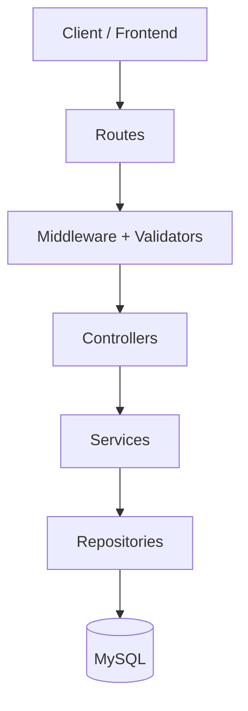

# Backend Architecture

The backend is organized as a layered Express application so each module has one responsibility and can grow without coupling HTTP, business rules, and SQL together.

## Layers

- **Routes** map URLs and HTTP verbs to middleware and controllers.
- **Validators** normalize and validate request input before controllers run.
- **Controllers** only read the request, call a service, and return a standardized response.
- **Services** contain business rules such as registration, login, profile updates, and password changes.
- **Repositories** own SQL and database transaction boundaries.
- **Helpers** provide shared primitives such as JWT, responses, errors, and string normalization.

## Rules for Future Development

- Do not write SQL in controllers or services; add repository methods instead.
- Do not put business rules in routes or controllers; add service methods instead.
- Validate request bodies, params, and query strings before controllers receive data.
- Throw `AppError` for expected API errors so the response shape remains consistent.
